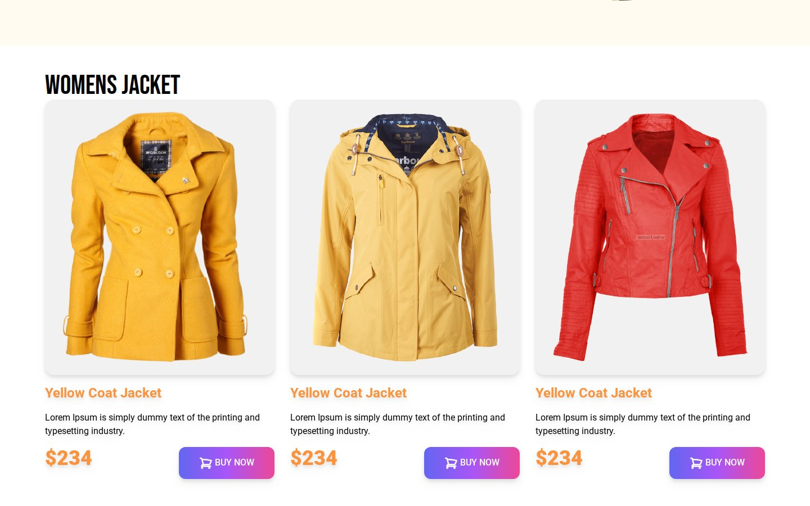
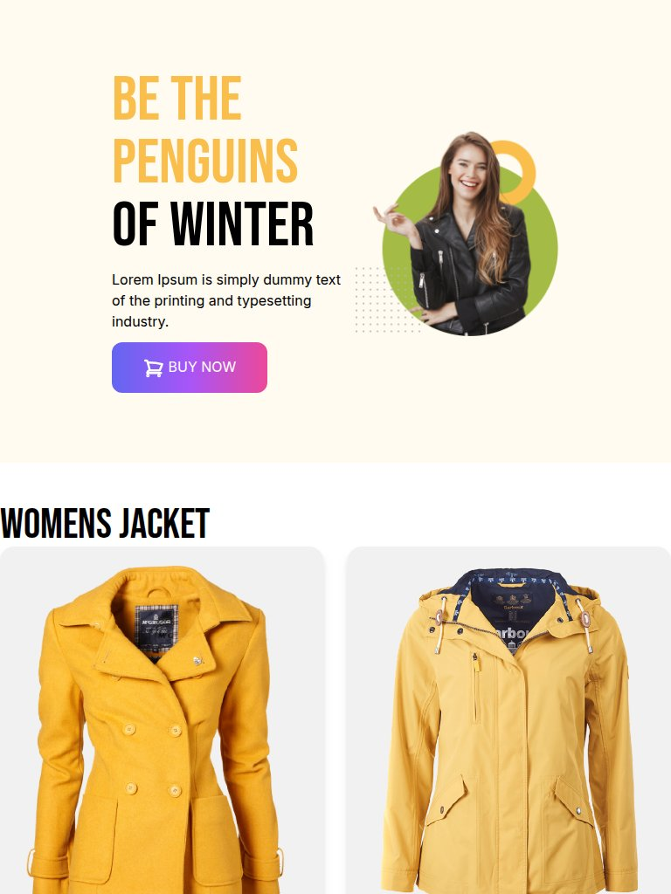
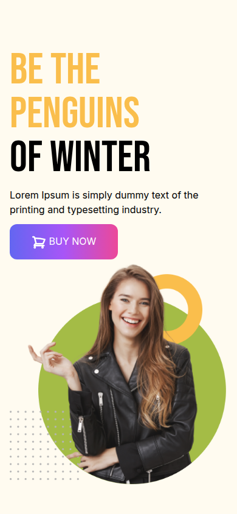

# Penguin Fashion

A winter jacket shop landing page built with Tailwind CSS: a hero banner and a product grid that goes from one to three columns.

**Live site:** <https://shayan-abrar.github.io/Penguin-Fashion-Shop/>

<p align="center">
  
</p>

<table>
  <tr>
    <td align="center"><a href="screenshots/preview.png"></a><br><sub><b>Hero</b> · desktop</sub></td>
    <td align="center"><a href="screenshots/products.jpg"></a><br><sub><b>Products</b> · 3 columns</sub></td>
    <td align="center"><a href="screenshots/tablet.jpg"></a><br><sub><b>Tablet</b> · 2 columns</sub></td>
    <td align="center"><a href="screenshots/phone.png"></a><br><sub><b>Phone</b> · stacked</sub></td>
  </tr>
</table>

A shop's first screen has to show the brand and its products clearly on any screen size. This page does that with Tailwind utility classes alone: a flex row for the hero and a grid for the products, with breakpoints that change the layout. The only custom CSS is two font classes, so it's a short, readable example of a responsive Tailwind layout.

## Quick Start

```bash
git clone https://github.com/SHAYAN-ABRAR/Penguin-Fashion-Shop.git
cd Penguin-Fashion-Shop
python3 -m http.server 8000
```

Open <http://localhost:8000>. On Windows, use `python` instead of `python3`. Opening `index.html` directly in a browser works too. Tailwind CSS and the Google Fonts load from the internet.

## Features

- **Hero:** the headline "Be the Penguins of Winter" in Bebas Neue, a model photo and a gradient **Buy Now** button with a cart icon.
- **Product cards:** each card in the "Womens Jacket" section has a photo on a gray panel, a name, a short description, a price and a **Buy Now** button.
- **Responsive grid:** one column on phones, two from 768px (`md:grid-cols-2`) and three from 1,024px (`lg:grid-cols-3`).
- **Responsive hero:** the text sits above the photo on phones and beside it from 768px (`flex-col md:flex-row`).
- **Typography and icons:** Bebas Neue for the headline and section title, Roboto for the product cards and an inline SVG cart icon, so no icon library is needed.

## Usage Example

All the product cards live in one grid, so the breakpoints are set in a single place:

```html
<div class="grid grid-cols-1 md:grid-cols-2 lg:grid-cols-3 gap-7 font-roboto">
```

To add a product, copy one of the card blocks inside this grid (they're marked `<!-- jacket 1 -->` to `<!-- jacket 3 -->` in `index.html`) and change the image, name and price. `images/jacket-4.png` to `images/jacket-6.png` are already in the repository for the next cards.

## Limitations

- The page is unfinished. It has the hero and one product section, and all three cards say "Yellow Coat Jacket" and "$234" with Lorem Ipsum placeholder text.
- The **Buy Now** buttons aren't connected to anything, and there's no navigation bar or footer.
- At 1,280px wide and below, the product section has no side padding, so its heading and cards touch the edges of the screen.
- `images/jacket-4.png` to `images/jacket-6.png`, `images/shopping.png` and the files in `icons/` aren't used yet. `tailwind.config.js` isn't used either, because the page loads Tailwind from the Play CDN.
- The browser tab title is spelled "Penguine Fashion".

## Tech Stack

- HTML5
- Tailwind CSS (Play CDN)
- Google Fonts: Bebas Neue and Roboto
- Hosted on GitHub Pages

## Contributing

Suggestions and bug reports are welcome. Please [open an issue](https://github.com/SHAYAN-ABRAR/Penguin-Fashion-Shop/issues). Please read the license note below before reusing any code or images.

## License

This repository doesn't have a license yet, so it doesn't grant anyone permission to reuse or redistribute its code or images. Please ask before reusing any part of it.

---

Built by **Shayan Abrar** · [GitHub](https://github.com/SHAYAN-ABRAR) · [LinkedIn](https://www.linkedin.com/in/shayan-abrar/)
