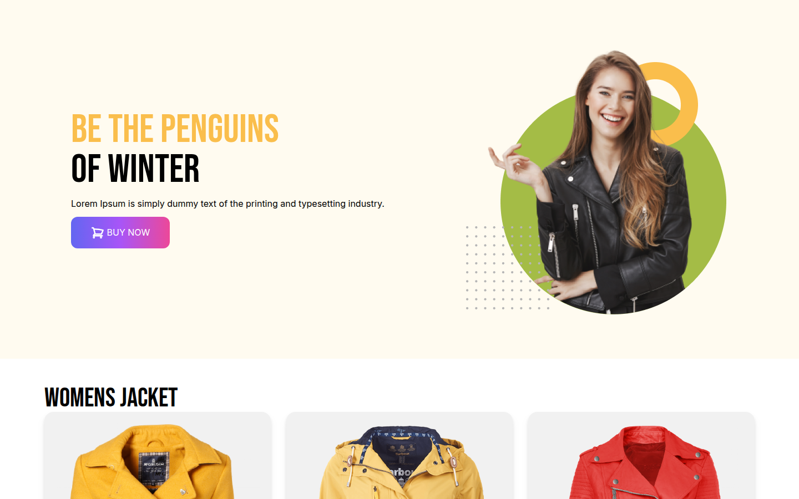

# Penguin Fashion — Winter Jacket Store

A responsive landing page for a winter-wear shop: a bold hero banner and a product grid of women's jackets. It's built with **HTML** and **Tailwind CSS**.

[](https://shayan-abrar.github.io/Penguin-Fashion-Shop/) <!-- live-demo -->




## Features

- **Hero section:** "Be the Penguins of Winter", with a model image and a *Buy Now* button
- **Product grid:** jacket cards with image, name, description, price and a *Buy Now* button with a cart icon
- **Responsive layout:** one column on phones, two on tablets and three on desktop (`grid-cols-1 md:grid-cols-2 lg:grid-cols-3`)
- **Custom typography:** Bebas Neue for headings and Roboto for body text
- **Inline SVG icons:** lightweight cart icons with no icon library

## Tech Stack

| Layer | Technology |
| --- | --- |
| Markup | HTML5 |
| Styling | Tailwind CSS (Play CDN) |
| Typography | Google Fonts (Bebas Neue, Roboto) |
| Hosting | GitHub Pages |

## Run Locally

```bash
git clone https://github.com/SHAYAN-ABRAR/Penguin-Fashion-Shop.git
cd Penguin-Fashion-Shop
# Open index.html in a browser
```

## Author

**Shayan Abrar** · [GitHub](https://github.com/SHAYAN-ABRAR) · [LinkedIn](https://www.linkedin.com/in/shayan-abrar/) · [Portfolio](https://shayan-abrar.vercel.app)
