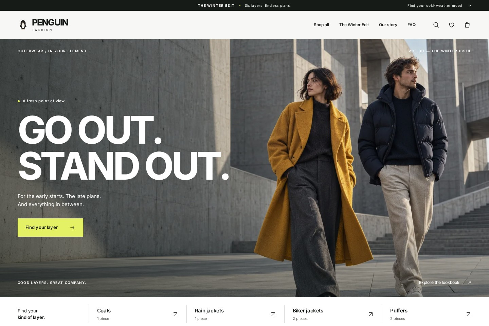
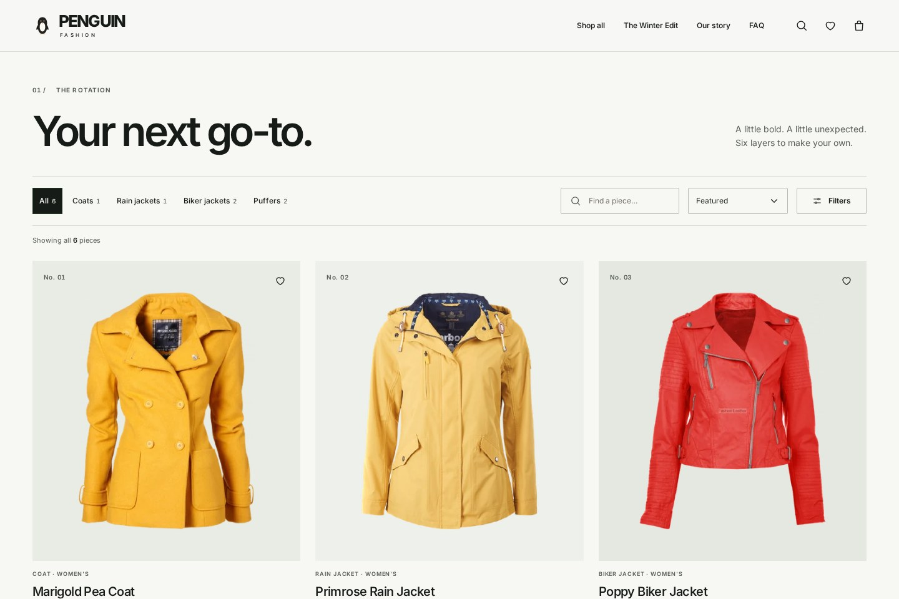
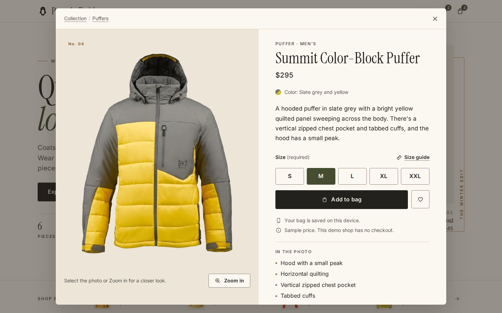
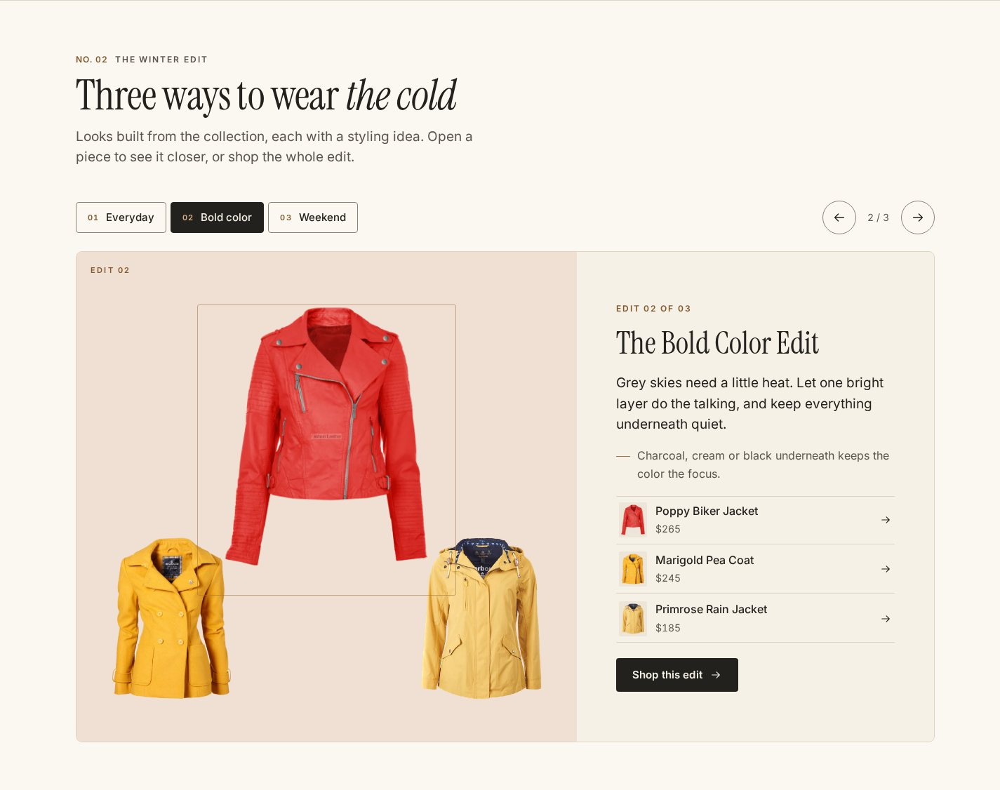
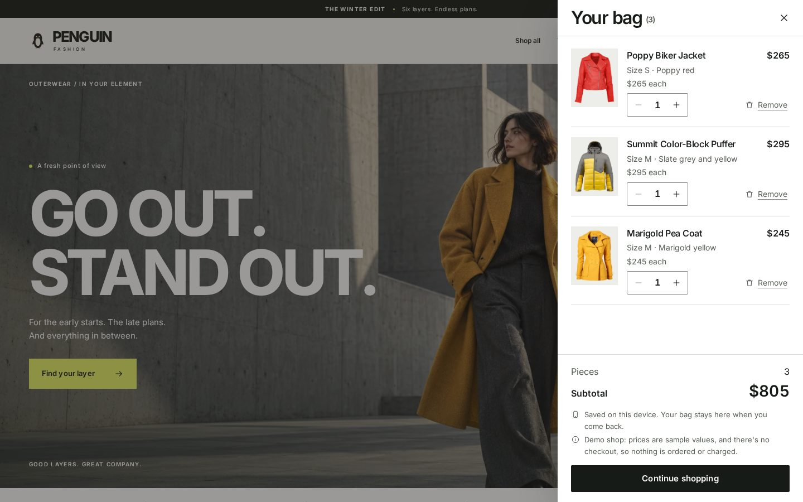
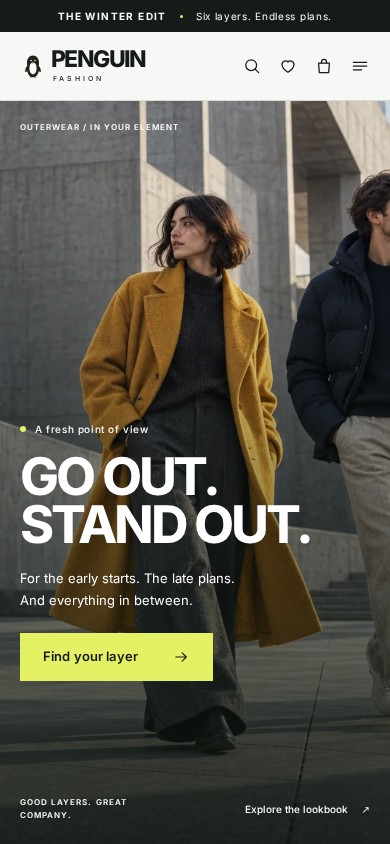

# Penguin Fashion

A small winterwear boutique storefront, styled like a printed winter lookbook. It has six coats and jackets, search and filters, a product view with zoom and a size guide, a shoppable "Winter Edit", and a bag and wishlist that are saved in your browser. It's a demo: the products, sizes and prices are sample data, and there's no checkout.

**Live site:** <https://shayan-abrar.github.io/Penguin-Fashion-Shop/>

<p align="center">
  
</p>

<table>
  <tr>
    <td align="center" width="20%"><a href="screenshots/collection.jpg"></a><br><sub><b>Collection</b></sub></td>
    <td align="center" width="20%"><a href="screenshots/product.jpg"></a><br><sub><b>Product view</b></sub></td>
    <td align="center" width="20%"><a href="screenshots/winter-edit.jpg"></a><br><sub><b>The Winter Edit</b></sub></td>
    <td align="center" width="20%"><a href="screenshots/bag.jpg"></a><br><sub><b>Bag</b></sub></td>
    <td align="center" width="20%"><a href="screenshots/mobile.jpg"></a><br><sub><b>Phone</b></sub></td>
  </tr>
</table>

## Run it locally

There's no build step and nothing to install. The scripts are ES modules, so the site needs a local web server; opening `index.html` straight from the file system won't run them.

```bash
git clone https://github.com/SHAYAN-ABRAR/Penguin-Fashion-Shop.git
cd Penguin-Fashion-Shop
python3 -m http.server 8000
```

Open <http://localhost:8000>. On Windows, use `python` instead of `python3`.

To preview it under the same `/Penguin-Fashion-Shop/` path that GitHub Pages uses, run the server from the folder that contains the project:

```bash
cd ..
python3 -m http.server 8000
```

Then open <http://localhost:8000/Penguin-Fashion-Shop/>. Python shows its own error page for missing paths; the custom `404.html` only appears on GitHub Pages.

## What's on the site

- **Header:** the Penguin Fashion mark, links to each section, search, saved pieces and the bag, with live counts. On phones the links move into a menu that opens from the bottom of the screen.
- **Hero:** "Quiet layers for loud weather", with **Explore the collection** and a link to the Winter Edit, beside a composition of two pieces from the collection. Shortcuts for each style sit just below it.
- **Collection:** search by name, color or style; filter by style (coats, rain jackets, biker jackets, puffers), fit (women's or men's) and hooded; sort by price. Active filters show as tags you can remove, with a result count, **Clear all** and a designed no-results state. The current search, filters and sort are kept in the address, so they survive a refresh and the back button.
- **Product view:** opens over the collection as a dialog, with a large photo you can zoom (select it, then move across it; arrow keys work too), the price, color, description and what's visible in the photo. A size is required before **Add to bag**, with an inline message if it's missing. The size guide has how-to-measure steps and sample measurements in centimeters or inches. Related pieces open in the same view. The back button closes it, leaving your filters and scroll position as they were, and `?product=<id>` links open a piece directly.
- **The Winter Edit:** three looks built from the collection (Everyday, Bold color and Weekend), each with its own composition, a styling idea, links to its pieces and **Shop this edit**, which shows just those pieces in the collection. The carousel moves only when you use its buttons, tabs, arrow keys or a swipe.
- **About, FAQ and footer:** why "penguins", answers about sizing, saving and ordering, and a footer with links and the demo notice.

## The bag and saved pieces

- The bag is saved in the browser's `localStorage` under `penguin-fashion:cart:v1` as `{"v":1,"items":[{"id":"…","size":"M","qty":1}],"savedAt":"…"}`. Saved pieces use `penguin-fashion:wishlist:v1` as `{"v":1,"ids":["…"],"savedAt":"…"}`. Nothing else is stored, and nothing is sent anywhere.
- Adding the same piece in the same size again combines into one line; a different size gets its own line. Quantities go from 1 to 10. Removing a line or a saved piece offers **Undo**.
- Prices aren't stored. They always come from the catalog, so line totals and the subtotal stay correct.
- Both are still there after a refresh or after closing and reopening the browser, on the same browser and device, and other open tabs update to match.
- Saved data is checked whenever it's read. Data that can't be read or comes from an older format is reset. Pieces that are no longer in the catalog, unavailable sizes and invalid quantities are removed, quantities over 10 are lowered, and repeated lines are merged. The bag explains what changed, once.
- If the browser won't save anything (some private modes, blocked site data, or full storage), the bag and saved pieces still work while the page is open, and the site says they won't be kept.
- There's no checkout. Adding a piece doesn't order or reserve it.

## What's sample content

- **Names and descriptions** describe what each photo shows. The names are descriptive labels, not the makers' model names.
- **Prices** are sample values in US dollars, and the footer and bag say so.
- **Sizes and the size guide's measurements** are samples: typical body measurements, not measurements taken from these garments. The size guide labels them that way.
- There are no discounts, stock levels, delivery promises, reviews or material certifications anywhere on the site.
- **Photos:** the six product photos came with the original version of this project, and their sources aren't recorded. Several show other brands' labels or logos, and one has a faint text mark on the chest. Check where they came from before using the site beyond a demo.

## Project structure

```text
index.html                    The storefront (one page, with dialogs for the product view, bag and more)
404.html                      Not-found page for GitHub Pages (uses /Penguin-Fashion-Shop/ paths)
assets/css/tokens.css         Typefaces, colors, type scale, spacing, shape and motion
assets/css/base.css           Reset, typography, buttons, chips, form controls, focus and utilities
assets/css/sections.css       Header, hero, collection, Winter Edit, about, FAQ and footer
assets/css/overlays.css       Product view, size guide, bag and saved drawers, sheets and toasts
assets/js/catalog.js          The catalog: products, styles, fits, sizes, the size chart and the edits
assets/js/store.js            The bag and saved pieces: reading, checking and saving localStorage
assets/js/collection.js       Search, filters, sorting, the product grid and the address
assets/js/product-view.js     The product view, zoom, size selection and related pieces
assets/js/size-guide.js       The size guide
assets/js/lookbook.js         The Winter Edit carousel
assets/js/bag-drawer.js       The bag
assets/js/saved-drawer.js     Saved pieces
assets/js/header.js           Counts, the section you're in, the mobile menu and search
assets/js/hero.js             Hero captions and the style shortcuts, filled in from the catalog
assets/js/ui.js               Shared helpers: prices, icons, dialogs, announcements and toasts
assets/js/actions.js          A small registry the modules use to call each other
assets/js/main.js             Starts everything
assets/img/products/          Product photos as WebP at 720, 400 and 200 pixels wide
assets/fonts/                 Instrument Serif and Inter (WOFF2) with their licenses
tools/prepare_product_image.py  Prepares a new product photo at the same scale as the others
screenshots/                  Images used in this README
```

### Adding a product

1. Start from a cut-out photo of the garment on a transparent background, then run `python3 tools/prepare_product_image.py path/to/photo.png new-piece` (it needs Pillow). It trims the photo and places the garment at the same scale as the others on a 4:5 canvas, in three sizes.
2. Add an entry to `PRODUCTS` in `assets/js/catalog.js` with `image: "new-piece"`, a style, a fit, a price and a description of what the photo shows.
3. To feature it in the Winter Edit, add its id to one of the `EDITS`.

Cards, the product view, search, filters, the edits, the bag and saved pieces all read from the catalog, so there's nothing else to update. A piece that's removed from the catalog is dropped from saved bags, with a notice.

## Accessibility

- Semantic landmarks and headings, a "Skip to content" link, and a visible focus ring on every control.
- The product view, size guide, bag, saved pieces, menu and filters are native modal dialogs: focus moves into them and stays there, Escape closes them, the page behind doesn't scroll, and focus returns to what opened them.
- Required size selection is announced, with the message linked to the size options. Bag changes, filter results and carousel moves are announced to screen readers.
- The carousel never moves on its own, and slides that aren't showing are hidden from keyboard and screen-reader users.
- Buttons and other controls are 40 to 48 pixels, and smaller text links still meet WCAG's 24-pixel minimum. Text meets WCAG AA contrast, and animations switch off when the system asks for reduced motion.
- Images have descriptive alt text and fixed dimensions, and images below the fold load lazily.

## Design

- **Typefaces:** Instrument Serif for headlines and product names, and Inter for everything else. Both are self-hosted, so nothing loads from other sites.
- **Colors:** warm ivory (`#F6F1E7`) and paper (`#FBF8F2`) backgrounds, stone (`#ECE5D8`) image panels, charcoal (`#23211D`) text and buttons, muted olive (`#5E6644`) for selected and success states, and small touches of bronze (`#A5723F`).
- Every product photo is shown in full, at the same scale, on a 4:5 panel, so shapes can be compared at a glance.

## Tech stack

- HTML, CSS and JavaScript modules, with no framework, dependencies or build step
- Instrument Serif and Inter typefaces, self-hosted
- Hosted on GitHub Pages

## Credits

- **Typefaces:** Instrument Serif, Copyright 2022 The Instrument Serif Project Authors, and Inter, Copyright 2016 The Inter Project Authors, both under the SIL Open Font License 1.1. The license files are in `assets/fonts/`.
- **Photos:** the product photos came with the original version of this project, and their sources aren't recorded.

## Contributing

Suggestions and bug reports are welcome. Please [open an issue](https://github.com/SHAYAN-ABRAR/Penguin-Fashion-Shop/issues). Please read the license note below before reusing any code or images.

## License

This repository doesn't have a license yet, so it doesn't grant anyone permission to reuse or redistribute its code or images. Please ask before reusing any part of it.

---

Built by **Shayan Abrar** · [GitHub](https://github.com/SHAYAN-ABRAR) · [LinkedIn](https://www.linkedin.com/in/shayan-abrar/)
