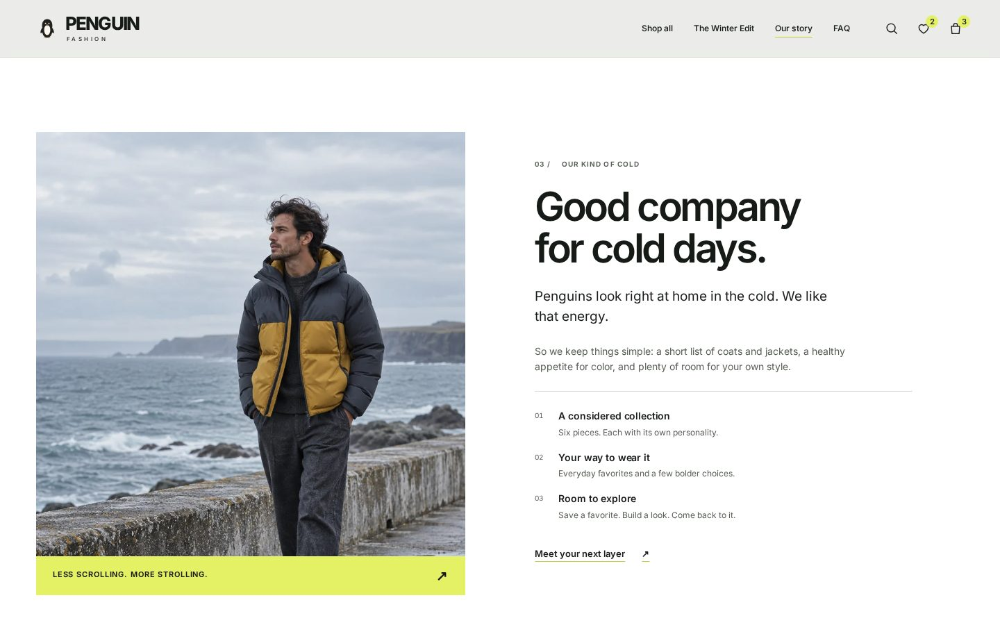
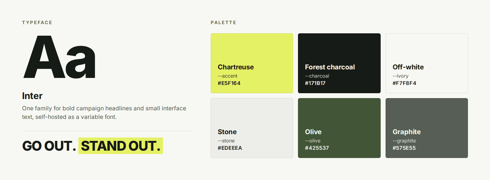
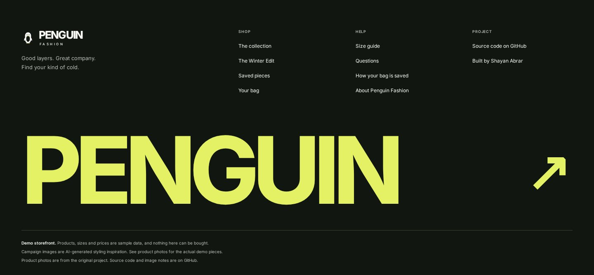

<p align="center">
  <a href="https://shayan-abrar.github.io/Penguin-Fashion-Shop/">
    
  </a>
</p>

<h1 align="center">Penguin Fashion</h1>

<p align="center">
  <b>Go out. Stand out.</b> A winter outerwear storefront with a bold editorial look:<br>
  six coats and jackets, a shoppable lookbook, and a bag that's saved on your device.
</p>

<p align="center">
  <a href="https://shayan-abrar.github.io/Penguin-Fashion-Shop/"><b>View the live site</b></a>
  &nbsp;·&nbsp; <a href="#screenshots">Screenshots</a>
  &nbsp;·&nbsp; <a href="#features">Features</a>
  &nbsp;·&nbsp; <a href="#design">Design</a>
  &nbsp;·&nbsp; <a href="#run-it-locally">Run it locally</a>
</p>

<p align="center">
  
  
  
  
</p>

---

Penguin Fashion is a demo storefront dressed as an outerwear campaign. It opens with a full-bleed city hero, then a clean shopping grid, a dark shoppable lookbook, a coastal brand story and an oversized footer wordmark. Behind the campaign styling is a complete browsing experience: search and filters, a product view with zoom and a size guide, and a bag and saved list that stay in your browser.

It's plain HTML, CSS and JavaScript modules, with no framework, nothing to install and no build step.

> [!NOTE]
> This is a demo, not a shop. Products, sizes and prices are sample data, there's no checkout, and nothing is ever ordered or charged.

## Screenshots

<table>
  <tr>
    <td width="50%" valign="top">
      <a href="screenshots/collection.jpg"></a>
      <br><sub><b>The collection</b> · style chips, search, filters and price sorting</sub>
    </td>
    <td width="50%" valign="top">
      <a href="screenshots/product.jpg"></a>
      <br><sub><b>Product view</b> · zoom, sizes and the size guide</sub>
    </td>
  </tr>
  <tr>
    <td colspan="2" valign="top">
      <a href="screenshots/winter-edit.jpg"></a>
      <br><sub><b>The Winter Edit</b> · three shoppable looks in a carousel you control</sub>
    </td>
  </tr>
  <tr>
    <td width="50%" valign="top">
      <a href="screenshots/bag.jpg"></a>
      <br><sub><b>Bag</b> · quantities, undo and a subtotal from the catalog</sub>
    </td>
    <td width="50%" valign="top">
      <a href="screenshots/story.jpg"></a>
      <br><sub><b>Our story</b> · a coastal editorial with three principles</sub>
    </td>
  </tr>
</table>

<p align="center">
  <a href="screenshots/mobile.jpg"></a>
  <br><sub>On phones, the menu, filters and bag open as sheets from the bottom of the screen, and <b>Add to bag</b> stays within reach.</sub>
</p>

## Features

### Shop the collection

- **Find your kind of layer:** shortcuts for coats, rain jackets, biker jackets and puffers, each with a live count.
- **Search** by name, color or style, from the collection or from the header, where matches appear as you type.
- **Filter** with style chips, and by fit (women's or men's) and hooded pieces in the Filters panel. **Sort** by lowest or highest price.
- Active filters show as tags you can remove, with a result count, **Clear all** and a friendly no-results state.
- The search, filters and sort are kept in the address, so a refresh keeps them and you can share a filtered view as a link.

### Product view

- Opens over the collection with a large photo you can zoom: click or tap it and move across it, or use the arrow keys.
- Shows the price, color, a description and what's visible in the photo.
- A size is required before **Add to bag**, with an inline message if it's missing. The size guide explains how to measure and lists sample measurements in centimeters or inches.
- Related pieces open in the same view. The back button closes it with your filters and scroll position intact, and `?product=<id>` links open a piece directly.

### The Winter Edit

- A shoppable lookbook with three looks, **Everyday**, **Bold color** and **Weekend**, each pairing a campaign image with a styling idea and links to the pieces.
- **Shop this edit** shows just those pieces in the collection.
- The carousel only moves when you ask it to, with its buttons, tabs, arrow keys or a swipe.

### Bag and saved pieces

- Both are saved in your browser's `localStorage`, under `penguin-fashion:cart:v1` and `penguin-fashion:wishlist:v1`. Nothing is sent anywhere.
- Adding the same piece in the same size combines into one line, and a different size gets its own line. Quantities go from 1 to 10, and removing something offers **Undo**.
- Prices always come from the catalog, so totals stay correct.
- Both survive a refresh or closing the browser, and other open tabs update to match.
- Saved data is checked whenever it's read. Damaged or outdated entries are repaired, and the bag explains what changed. If the browser can't save at all, the bag still works for the visit and says it won't be kept.

### Accessibility

- A "Skip to content" link, clear headings and a visible focus ring.
- The product view, size guide, bag, saved pieces, menu and filters are native dialogs. Focus moves into them and stays there, Escape closes them, the page behind doesn't scroll, and focus returns to what opened them.
- Missing sizes, bag changes, filter results and carousel moves are announced to screen readers.
- The lookbook never moves on its own, and slides that aren't showing can't be reached by keyboard or screen readers.
- Animations switch off when your system asks for reduced motion.
- Images have descriptive alt text and fixed dimensions, and images further down the page load lazily.

## Design

The art direction is a contemporary outerwear campaign: big, tight Inter headlines, cool off-white and stone surfaces, deep forest-charcoal sections and a single chartreuse accent for the moments that matter.

<p align="center">
  
</p>

- **Typeface:** Inter, self-hosted as one variable font, for both the campaign headlines and the small interface text.
- **Color:** the palette, type scale and spacing are tokens in `assets/css/tokens.css`.
- **Photography:** product photos are always shown whole, at the same scale, on matching stone panels, so shapes are easy to compare. The three campaign images are mood photography. They're labelled on the site as AI-generated styling inspiration, and they never stand in for the products.
- **Motion:** small hover details and a short entrance animation, all switched off for reduced motion.

<p align="center">
  
</p>

## Run it locally

There's nothing to install. The scripts are JavaScript modules, so the site needs a local web server; opening `index.html` straight from the file system won't run them.

```bash
git clone https://github.com/SHAYAN-ABRAR/Penguin-Fashion-Shop.git
cd Penguin-Fashion-Shop
python3 -m http.server 8000
```

Open <http://localhost:8000>. On Windows, use `python` instead of `python3`.

To preview it under the same `/Penguin-Fashion-Shop/` path that GitHub Pages uses, run the server from the folder that contains the project instead, and open <http://localhost:8000/Penguin-Fashion-Shop/>:

```bash
cd ..
python3 -m http.server 8000
```

Python shows its own page for missing paths; the custom `404.html` only appears on GitHub Pages.

## Project structure

```text
index.html                      The storefront: one page, with dialogs for products, the bag and more
404.html                        Not-found page for GitHub Pages (uses /Penguin-Fashion-Shop/ paths)
DESIGN_REVIEW.md                Notes from the editorial redesign
assets/css/tokens.css           Typeface, colors, type scale, spacing, shape and motion
assets/css/base.css             Reset, typography, buttons, chips, form controls and focus
assets/css/sections.css         Header, campaign hero, collection, lookbook, story, FAQ and footer
assets/css/overlays.css         Product view, size guide, bag and saved drawers, sheets and toasts
assets/js/catalog.js            Products, styles, fits, sizes, the size chart and the edits
assets/js/store.js              The bag and saved pieces in localStorage, checked on every read
assets/js/collection.js         Search, filters, sorting, the product grid and the address
assets/js/product-view.js       The product view, zoom, size selection and related pieces
assets/js/size-guide.js         The size guide
assets/js/lookbook.js           The Winter Edit carousel
assets/js/bag-drawer.js         The bag
assets/js/saved-drawer.js       Saved pieces
assets/js/header.js             Counts, the section you're in, the mobile menu and search
assets/js/hero.js               Style shortcuts with live catalog counts
assets/js/ui.js                 Shared helpers: prices, icons, dialogs and announcements
assets/js/actions.js            A small registry the modules use to call each other
assets/js/main.js               Starts everything
assets/img/products/            Product photos as WebP at 720, 400 and 200 pixels wide
assets/img/editorial/           The three campaign images (responsive WebP), with prompts
assets/fonts/                   Inter, Instrument Serif (from the previous design) and their licenses
tools/prepare_product_image.py  Prepares a new product photo at the same scale as the rest
screenshots/                    Images used in this README
```

### Adding a product

1. Start from a cut-out photo of the garment on a transparent background, then run `python3 tools/prepare_product_image.py path/to/photo.png new-piece` (it needs Pillow). It trims the photo and places the garment at the same scale as the others on a 4:5 canvas, in three sizes.
2. Add an entry to `PRODUCTS` in `assets/js/catalog.js` with `image: "new-piece"`, a style, a fit, a price and a description of what the photo shows.
3. To feature it in the Winter Edit, add its id to one of the `EDITS`.

Cards, the product view, search, filters, the edits, the bag and saved pieces all read from the catalog, so there's nothing else to update. A piece that's removed from the catalog is dropped from saved bags, with a notice.

## What's sample content

- **Names and descriptions** describe what each photo shows. The names are descriptive labels, not the makers' model names.
- **Prices** are sample values in US dollars, and the footer and bag say so.
- **Sizes and the size guide's measurements** are samples: typical body measurements, not measurements taken from these garments. The size guide labels them that way.
- There are no discounts, stock levels, delivery promises, reviews or material certifications anywhere on the site.
- **Product photos:** the six product photos came with the original version of this project, and their sources aren't recorded. Several show other brands' labels or logos, and one has a faint text mark on the chest. Check where they came from before using the site beyond a demo.
- **Campaign images:** the city, color and coast images are AI-generated styling inspiration made for the redesign. They aren't photographs of the catalog pieces or of real customers. Their prompts are in [assets/img/editorial/README.md](assets/img/editorial/README.md).

## Tech stack

- HTML, CSS and JavaScript modules, with no framework, dependencies or build step
- Inter, self-hosted as a variable WOFF2 font
- Responsive WebP images
- Hosted on GitHub Pages

## Credits

- **Typefaces:** Instrument Serif, Copyright 2022 The Instrument Serif Project Authors, and Inter, Copyright 2016 The Inter Project Authors, both under the SIL Open Font License 1.1. The license files are in `assets/fonts/`.
- **Product photos:** the product photos came with the original version of this project, and their sources aren't recorded.
- **Campaign imagery:** three original images generated for this redesign. See the [image notes and prompts](assets/img/editorial/README.md).

## Contributing

Suggestions and bug reports are welcome. Please [open an issue](https://github.com/SHAYAN-ABRAR/Penguin-Fashion-Shop/issues). Please read the license note below before reusing any code or images.

## License

This repository doesn't have a license yet, so it doesn't grant anyone permission to reuse or redistribute its code or images. Please ask before reusing any part of it.

---

Built by **Shayan Abrar** · [GitHub](https://github.com/SHAYAN-ABRAR) · [LinkedIn](https://www.linkedin.com/in/shayan-abrar/)
